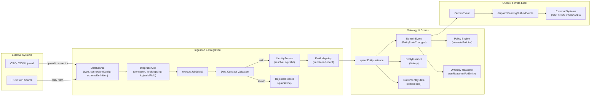
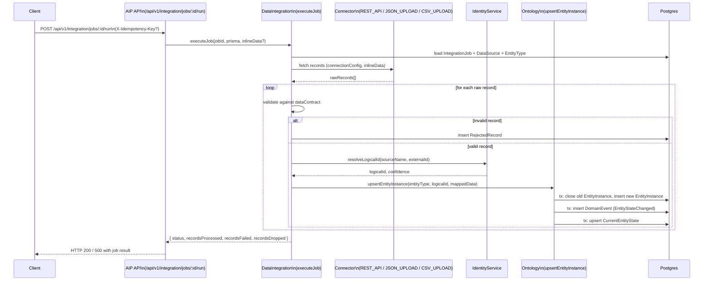

# Data Quality, Domain Events, and Outbox Architecture

> This document explains how ingestion quality, domain events, and the outbox pattern work in the AIP backend, and how
> frontend experiences (e.g. the Integrations page) should consume them.

---

## 1. Scope & Overview

This doc covers:

- How raw records flow from external sources into the Ontology.
- How bad data is detected, blocked, and quarantined.
- How entity changes are recorded as immutable `DomainEvent`s and projected into `CurrentEntityState`.
- How idempotency is enforced at the HTTP layer.
- How the `OutboxEvent` model and dispatcher prepare the system for reliable external write‑back.

Relevant files:

- Backend:
  - `prisma/schema.prisma`
  - `src/data-integration.ts`
  - `src/domain-events.ts`
  - `src/middleware.ts`
  - `src/server.ts`
  - `src/outbox-dispatcher.ts`
- Frontend:
  - `frontend/src/app/integrations/page.tsx`
  - `frontend/src/lib/ApiClient.ts`

---

## 1.5 Architecture Diagrams & Call Flows

### 1.5.1 High-level ingestion & event flow



### 1.5.2 Integration job sequence (happy path)



---

## 2. Ingestion & Data Quality

### 2.1 Data models

**DataSource**

The `DataSource` model represents a logical upstream system or feed:

- `id` (String, PK)
- `name` (unique)
- `type` (e.g. `REST_API`, `JSON_UPLOAD`, `CSV_UPLOAD`)
- `connectionConfig Json` — connector‑specific configuration (URL, headers, auth, etc.).
- `schemaDefinition Json?` — optional expected schema / constraints.
- `projectId` (tenant / workspace).

**RejectedRecord**

The `RejectedRecord` model captures rows that failed validation at ingestion time and were quarantined:

- `id` — UUID.
- `projectId` — owning project/tenant (FK to `Project`).
- `dataSourceId?` — FK to `DataSource` (may be null if unknown).
- `jobId?` — identifier of the integration job that attempted ingestion.
- `rawRecord Json` — the original record as received.
- `errors Json` — structured info about what failed (currently the data contract; can be refined).
- `createdAt` — timestamp of rejection.

Indexes support efficient querying by project and data source.

### 2.2 Integration job execution flow

Integration logic lives in `src/data-integration.ts`, primarily in `executeJob`:

1. **Load job + metadata**
   - Fetches the `IntegrationJob` plus its `DataSource` and target `EntityType`.
   - Determines connector (`REST_API`, `JSON_UPLOAD`, `CSV_UPLOAD`) and logical ID field.

2. **Fetch raw records**
   - Uses connector functions (e.g. `REST_API`, `JSON_UPLOAD`, `CSV_UPLOAD`) to produce an array of raw records:
     - `rawRecords: Record<string, unknown>[]`.

3. **Data contract validation**
   - A contract object (`dataContract`) defines simple constraints such as:
     - `required`: list of required fields.
     - `types`: expected JS types for certain fields.
     - Optional `threshold`: maximum allowed drop ratio (default 5%).
   - For each raw record:
     - If it fails the contract, the record is considered **rejected**.
     - The system **does not** write it to the ontology and increments `recordsDropped`.
     - A `RejectedRecord` row is created with:
       - `projectId` from `job.targetEntityType.projectId` or `DEFAULT_PROJECT_ID`.
       - `dataSourceId` from `job.dataSourceId`.
       - `jobId` from `job.id`.
       - `rawRecord` = raw data.
       - `errors` = current contract JSON (future‑proofed for detailed errors).
     - Any error while inserting `RejectedRecord` is logged but does not abort the job.

4. **Identity & ontology mapping**
   - For valid records (that pass the contract):
     - Resolves a logical ID via `IdentityService` (or uses the external ID directly).
     - Maps external fields to ontology attributes using `fieldMapping`.
     - Calls `upsertEntityInstance` to write the entity into the ontology (see §3).

5. **Drop‑ratio guardrail**
   - At the end, the job computes:
     - `totalProcessed = recordsProcessed + recordsFailed + recordsDropped`.
     - `dropRatio = recordsDropped / totalProcessed`.
   - If `dropRatio` exceeds the configured threshold, the job throws a **Data Quality Violation** error to prevent large‑scale contamination of the ontology.

### 2.3 Data quality APIs

Two HTTP endpoints expose data quality to the UI. Both are project‑scoped.

**Summary per DataSource**

- **Route:** `GET /api/data/quality/summary?days=7`
- **Auth:** same project scoping as `/api/data/sources`; uses `req.auth.projectId` or `DEFAULT_PROJECT_ID`.
- **Parameters:**
  - `days` (optional, default `7`): look‑back window for rejected records.
- **Behavior:**
  - Loads all `DataSource` rows for the project.
  - Groups `RejectedRecord` rows by `dataSourceId` within the time window.
  - Returns an array of summaries:
    ```jsonc
    [
      {
        "id": "ds_123",
        "name": "Fleet SCADA System",
        "type": "REST_API",
        "createdAt": "2026-03-01T10:00:00.000Z",
        "rejectedRecords": 42
      }
    ]
    ```

**Detailed rejected records**

- **Route:** `GET /api/data/quality/rejected-records`
- **Auth:** same project scoping; uses `req.auth.projectId` or `DEFAULT_PROJECT_ID`.
- **Parameters (query):**
  - `dataSourceId` (optional): filter by a specific source.
  - `page` (optional, default `1`).
  - `pageSize` (optional, default `25`, max `100`). 
- **Behavior:**
  - Paginates `RejectedRecord` for the project (and optional `dataSourceId`).
  - Orders by `createdAt DESC`.
  - Response shape:
    ```jsonc
    {
      "total": 128,
      "page": 1,
      "pageSize": 25,
      "records": [
        {
          "id": "rej_1",
          "projectId": "proj_1",
          "dataSourceId": "ds_123",
          "jobId": "job_789",
          "rawRecord": { "...": "..." },
          "errors": { "...": "..." },
          "createdAt": "2026-03-12T12:00:00.000Z"
        }
      ]
    }
    ```

### 2.4 Frontend integration (Integrations page)

`frontend/src/app/integrations/page.tsx` loads data quality summary when the page mounts:

- Calls `ApiClient.get<DataQualitySourceSummary[]>('/api/data/quality/summary')`.
- Stores results in `qualitySummary` state for use in the SOURCES view.

The intended UX is a Palantir‑like data quality strip showing per‑source badges such as:

- “clean” (0 rejected).
- “N rejected” (non‑zero), possibly with an indicator color.

and a drill‑down table for rejected rows backed by `/api/data/quality/rejected-records`.

---

## 3. Domain Events & CurrentEntityState

The system uses an event‑sourced pattern:

- `DomainEvent` — immutable, append‑only log of entity changes.
- `EntityInstance` — full history (bi‑temporal fields like `validFrom`/`validTo`).
- `CurrentEntityState` — latest point‑in‑time projection for fast reads.

### 3.1 Upserting entities (`upsertEntityInstance`)

`upsertEntityInstance` in `src/data-integration.ts` is the canonical ingest path for ontology entities:

1. **Transaction start**
   - Uses `prisma.$transaction` to group:
     - History updates.
     - Domain event append.
     - Current state projection.

2. **History maintenance**
   - Locates any currently‑active `EntityInstance` for `(entityTypeId, logicalId)` and closes it (`validTo = now`).
   - Inserts a new active `EntityInstance` row with the incoming `data` and `validFrom = now`.

3. **Domain event append**
   - Creates a `DomainEvent` row with:
     - `eventType: 'EntityStateChanged'`.
     - `entityTypeId`, `logicalId`, `entityVersion` from `EntityType`.
     - `payload` JSON containing:
       - `previousState` (from old instance or `null`).
       - `newState` (incoming mapped attributes).
       - `validFrom` (ISO string of `now`).
     - Optionally an `idempotencyKey` (for dedup / tracing).

4. **CurrentEntityState projection**
   - Upserts `CurrentEntityState` keyed by `logicalId`:
     - Sets `entityTypeId`, `data`, and `updatedAt`.

5. **Policy evaluation & reasoning**
   - After the transaction commits, fire‑and‑forget async calls:
     - `evaluatePolicies` (governance/alerting).
     - `runReasonerForEntity` (ontology inference and relationship derivation).

### 3.2 `recordDomainEvent` helper

`src/domain-events.ts` exposes `recordDomainEvent` as a reusable helper to write canonical `DomainEvent`s:

- Accepts both a `PrismaClient` and an optional `Prisma.TransactionClient` so it can be used inside transactions.
- Ensures the `payload` always has `previousState`, `newState`, and `validFrom` (defaulting to now).
- Intended use:
  - New features (e.g. time‑travel APIs, branching, replay) should call this helper instead of hand‑crafting events.

### 3.3 Future work: replay & time travel

The current code already stores all required state to support:

- As‑of reads for a given `logicalId`.
- Full rebuilds of `CurrentEntityState` from `DomainEvent` for an `EntityType` (e.g. into a scratch table then swapped).

TODOs:

- Add an API like `GET /api/ontology/entity-types/:id/instances/:logicalId/history` with an `asOf` parameter.
- Add a background command to rebuild `CurrentEntityState` for a type and swap in a single transaction (for backfill or policy changes).

---

## 4. Idempotency Contracts

Idempotency is enforced at the HTTP layer using the `X-Idempotency-Key` header and the `DomainEvent.idempotencyKey` unique constraint.

### 4.1 Middleware

`enforceIdempotency(prisma)` in `src/middleware.ts`:

- Looks for header `X-Idempotency-Key`.
- If missing, the request is treated as non‑idempotent and passed through.
- If present and non‑empty:
  - Attempts to create a `DomainEvent` marker row with that key (`eventType = 'IdempotencyLock'`).
  - If the insert succeeds:
    - Attaches `idempotencyKey` to the request object (`req.idempotencyKey`) for downstream use.
    - Calls `next()`.
  - If it fails with unique violation (`P2002`):
    - Returns `409 Conflict` with an error indicating the request has already been processed.

### 4.2 Routes currently protected

The following routes are wrapped with `enforceIdempotency(prisma)` in `src/server.ts`:

- `POST /api/ontology/entity-types/:id/instances` — create data rows in the ontology.
- `POST /api/v1/integration/jobs/:id/run` — run an integration job.
- `POST /integration-jobs/:id/execute` — legacy direct job execute endpoint.
- `POST /api/automate/:id/run` — manual automation trigger.
- `POST /api/workshop` — create a new workshop app.

**Contract for callers:**

- Use a stable `X-Idempotency-Key` value per **business action** (e.g. originating client request ID).
- On network retries, reuse the same key to avoid double‑writes.

---

## 5. Outbox Pattern (Write‑back Scaffolding)

The outbox pattern is used to reliably propagate local ontology changes to external systems (e.g. SAP, Salesforce) without:

- Losing messages on process crashes.
- Tightly coupling HTTP request lifecycles to slow or flaky external services.

### 5.1 `OutboxEvent` model

`OutboxEvent` in `prisma/schema.prisma`:

- `projectId` — tenant / workspace.
- `aggregateType` — e.g. `Entity`, `WorkOrder`, `ChangeRequest`.
- `aggregateId` — ID of the entity in our system.
- `eventType` — business meaning (`MaintenanceApproved`, etc.).
- `targetSystem` — where to send this (`SAP`, `SALESFORCE`, `WEBHOOK`, etc.).
- `payload Json` — normalized, external‑facing payload.
- `status` — `PENDING`, `SENT`, `FAILED`, or `DEAD_LETTER`.
- `retryCount`, `lastError` — tracking for repeated failures.
- `domainEventId?` — optional link back to the `DomainEvent` that caused this outbox write.

### 5.2 Dispatcher

`dispatchPendingOutboxEvents(prisma)` in `src/outbox-dispatcher.ts`:

- Fetches up to 50 `PENDING` events ordered by `createdAt` (oldest first).
- For each event:
  - **Current behavior (placeholder):**
    - Marks it as `SENT` with `lastError = null` (no real external call yet).
  - **On error:**
    - Increments `retryCount`.
    - If `retryCount` >= `MAX_RETRIES` (5), marks as `DEAD_LETTER`, otherwise `FAILED`.

### 5.3 Future integration

To fully realize the outbox pattern:

- Application code should, inside the same DB transaction as local writes:
  - Update ontology / domain state (including `DomainEvent`).
  - Insert one or more `OutboxEvent` rows describing external actions.
- A background worker (or a simple `setInterval` in the API process for demo) should call `dispatchPendingOutboxEvents(prisma)` periodically.
- The dispatcher should be extended to:
  - Route events by `targetSystem`.
  - Call real external connectors (reusing patterns from `src/data-integration.ts` connectors where possible).

---

## 6. Summary & Next Steps

### What’s implemented

- **Ingestion:** Integration jobs validate records against a data contract; invalid data is quarantined in `RejectedRecord`.
- **Data quality:** APIs expose per‑source rejected counts and detailed rejected rows for UI dashboards.
- **Events:** Entity changes are written as `DomainEvent`s and projected into `CurrentEntityState`, with a helper for future features.
- **Idempotency:** Critical mutating routes enforce `X-Idempotency-Key` and avoid double‑writes on retries.
- **Outbox scaffolding:** `OutboxEvent` and a basic dispatcher exist, ready to be wired into real write‑back flows.

### Recommended next work

- **UI:** Finish the Data Quality panel in the Integrations page to surface real metrics instead of hardcoded health bars.
- **Replay & time travel:** Add APIs and commands that rebuild `CurrentEntityState` from `DomainEvent`s and support as‑of queries.
- **Outbox wiring:** Start populating `OutboxEvent` from ontology write‑back actions and hook up the dispatcher to real external systems.
- **RLS & ABAC:** Layer Postgres RLS and a central security context on top of this foundation to reach a stricter “Foundry‑grade” security posture.
