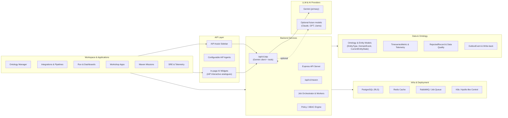
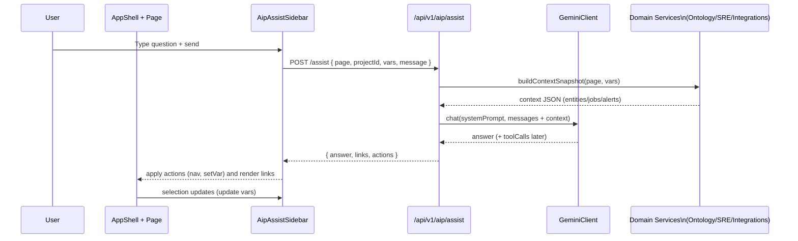
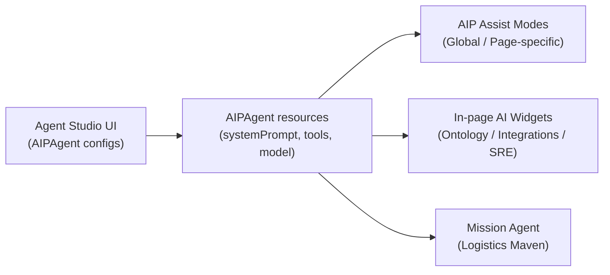

# Platform Architecture – AIP Alignment

This document describes the AIP-like architecture of the platform: how the workspace applications, AIP layer, backend services, data/ontology, LLMs, and infrastructure fit together. It is written to align conceptually with Palantir Foundry + AIP terminology and capabilities, while staying specific to this codebase.

---

## 1. Introduction

This platform is an "AIP-like" system built around a rich Ontology, event-sourced data model, and an agentic AI layer. At a high level it has three vertical slices:

- **Workspace & Applications** – Ontology Manager, Integrations & Pipelines, Run/Dashboards, Workshop Apps, Maven Missions, and SRE views. These are the primary user interfaces where users explore data, configure logic, and run mission workflows.
- **AIP Layer** – global AIP Assist sidebar, configurable AIP Agents, and in-page AI widgets (AIP Interactive analogues) that are aware of page context and application variables and are backed by the same agent/tool infrastructure.
- **Data, LLMs, and Infra** – the Ontology (EntityType, DomainEvent, CurrentEntityState), metrics and telemetry, data quality and outbox tables, Gemini as the primary LLM provider, and the supporting Postgres/Redis/MQ/Apollo-like runtime.

The goal is to achieve Palantir-style capabilities:

- Ontology-driven operations where every object and relationship is first-class and time-travelable.
- Context-aware agents that understand the current workspace, selection, and application state parameters.
- Secure multi-tenant operation via project scoping, RLS, and ABAC, combined with strong auditing via DomainEvent and OutboxEvent.

---

## 2. High-Level System Architecture

The following Mermaid diagram provides a high-level overview of how frontend applications, the AIP layer, backend services, data, LLMs, and infra connect.

Key points:

- All applications use a shared AppShell, navigation, and design system, and update an "intelligence store" describing page + selection context.
- AIP Assist and in-page widgets talk to the unified `/api/v1/aip` router, which in turn uses the `getLlmClient()` abstraction backed by Gemini.
- Backend services share a common Prisma model for Ontology, metrics, data quality, and Outbox, and integrate with Postgres/Redis/MQ for storage and queues.

---

## 3. AIP Assist & Agent Architecture

### 3.1 AIP Assist Sidebar

The **AipAssistSidebar** component is the global AIP surface in the UI. It is:

- Globally accessible from the AppShell (hotkey + top-bar button).
- Context-aware via the `useIntelligenceStore`, which tracks:
  - `activePage: PageId` – e.g., `"ontology" | "integrations" | "run" | "telemetry" | "maven" | "sre"`.
  - `selection: AipContextSelection` – entityTypeId, logicalId, pipelineId, jobId, workspaceId, tab, filters, and arbitrary `vars` for application state.
- Responsible for:
  - Displaying the conversation history.
  - Sending `AipAssistRequest` objects to `/api/v1/aip/assist` with `{ page, projectId, vars, message }`.
  - Applying returned `actions` and `links` to the UI (navigation, variable updates).

### 3.2 Backend AIP Assist Router

The **aip-router** (`src/routers/aip-router.ts`) exposes:

- `/tools` – discovery of registered tools from `AIPExecutor`.
- `/execute` – direct tool execution by name.
- `/assist` – Gemini-backed natural language interaction.

The `/assist` handler:

- Accepts `AipAssistRequest` with `page`, `projectId`, and `vars` (selection/application variables) plus the user `message`.
- Builds a page-specific `systemPrompt` with guidance for that module and embeds serialized `vars` for LLM awareness.
- Calls `llm.chat(...)` via the `getLlmClient()` abstraction, which returns an `answer` (and later toolCalls).
- Constructs an `AipAssistResponse` containing:
  - `answer` – Gemini's textual response.
  - `links` – navigation hints (entities, jobs, alerts, telemetry views).
  - `actions` – proposed navigation or variable updates (e.g., `activeTab = 'history'`).
  - `trace` – a future extension for tool call summaries.

### 3.3 Intelligence Store & Application Variables

The **Intelligence Store** (`frontend/src/store/intelligenceStore.ts`) is a small Zustand store that manages:

- `activePage: PageId`.
- `selection: AipContextSelection` including a `vars` object used as "application variables".

Pages such as Ontology, Integrations, Run Dashboard, and SRE Jobs call `setContext(page, selection)` on load and update `selection` as users interact. The Assist sidebar reads this store to build its requests and also writes back via `setVar(...)` based on AI-proposed actions.

This mimics Palantir AIP's notion of application state/variables that are visible to agents and interactive widgets.

### 3.4 Assist Sequence Diagram

The following sequence diagram illustrates the End-to-End flow of AIP Assist for a typical request:

---

## 4. Agent Studio & In-Page AIP Widgets

### 4.1 Agent Configuration (Agent Studio Analogue)

Agents are represented by the `AIPAgent` model (and a future "Agent Studio" UI) which describes:

- `name`, `description` – what the agent is for (e.g., "Global Assist", "Logistics Maven").
- `systemPrompt` – the high-level behavior description and instructions.
- `allowedTools` – a list of tool names from the tool registry the agent may call.
- `model` – Gemini model selection (e.g., `gemini-1.5-flash` or `gemini-1.5-pro`).

The intent is that:

- AIP Assist uses a configured agent for each "mode" or page.
- Maven mission chat uses a mission-specific agent definition.
- In-page widgets (AIP Interactive analogues) use dedicated agents with tightly scoped tools and variables.

### 4.2 In-Page AI Widgets

Several pages host local AI widgets that act like Palantir's AIP Interactive/Generated Content:

- **Ontology:** an assistant that can explain entity schemas, history, and relationships.
- **Integrations:** an assistant that helps debug ingestion, explain job failures, and analyze data quality.
- **SRE Jobs:** an assistant that can summarize job failures, retry strategies, and SLO status.
- **Maven:** a mission assistant that summarizes mission readiness, alerts, and suggests actions.

Each widget:

- Reads page-specific variables from `selection` / `vars`.
- Sends its own prompt and context to the `/assist` endpoint (optionally with an `agentId`).
- Presents responses inline in the page (not just in the global Assist sidebar).

### 4.3 Agent & Widget Flow Diagram

---

## 5. Mission (Maven) & SRE Views

### 5.1 Maven Missions

The Maven mission workspace is a mission-focused view that fuses Ontology entities, metrics, and alerts into a single "mission picture". It consists of:

- Frontend: `frontend/src/app/maven/page.tsx` – presenting mission KPIs, entity lists (e.g., convoys, ports), alerts, and an embedded mission assistant.
- Backend: `src/routers/maven-router.ts` – providing:
  - `/alerts` – active mission alerts for a project.
  - `/metrics` – mission metrics such as readiness and throughput computed from Ontology state.
  - `/chat` – mission-specific chat endpoint that uses the configured Maven agent and Gemini to propose and explain actions.

Data flows:

- The mission UI calls `/alerts` and `/metrics` to display the live mission posture.
- User questions and requests are sent to `/chat`, which:
  - Loads the "Logistics Maven" agent configuration.
  - Gathers context (current entities and alerts).
  - Calls Gemini via the unified LLM client.
  - Returns a structured answer, optionally with suggested reroutes or actions.

### 5.2 SRE Jobs & Telemetry

The SRE Jobs page (`frontend/src/app/sre/jobs/page.tsx`) is an operator-facing view of job telemetry and worker health. It:

- Calls `/api/v1/telemetry/jobs` to retrieve:
  - Summary metrics (queued/running/completed/failed jobs).
  - Active worker counts.
  - A recent jobs list with attempts, records processed, failures, and lastError.
- Integrates with `useIntelligenceStore` to set `activePage = 'sre'` and update `selection` when a job is clicked.
- Can be deep-linked via Assist `links` (`type: 'job'`) or proposed `actions`.

The AIP Assist (or a dedicated SRE widget) can then:

- Explain what a job is doing.
- Summarize common failure reasons.
- Suggest mitigation steps.

---

## 6. Security & Governance

Security and governance are cross-cutting concerns that affect all layers:

- **Multi-tenancy:** Most core tables (EntityType, CurrentEntityState, DomainEvent, RejectedRecord, OutboxEvent, etc.) have a `projectId` column for tenant isolation.
  - The roadmap includes enabling Postgres RLS and a session-level `aip.tenant_id` GUC to ensure that no query can cross tenant boundaries accidentally.

- **ABAC:** An ABAC engine (Attribute-Based Access Control) is used to express policies that combine actor and resource attributes:
  - Actor: role, clearance, project membership.
  - Resource: classification, owner, tags.
  - The security context layer enforces these policies on sensitive queries and actions.

- **Audit & Provenance:** DomainEvent and OutboxEvent provide a detailed audit trail of:
  - Ontology changes (entity and relationship events).
  - External write-back operations (what was requested, when, and with what payload).
  - Combined with provenance models, this supports both operational audits and compliance investigations.

- **Governance & Change Requests:** A ChangeRequest model and related flows (for entity types, pipelines, etc.) provide a mechanism to propose, review, and approve changes before they are applied to production workspaces.

Future versions of this document will include a dedicated security diagram and more detailed mapping to RLS policies once they are fully implemented.

