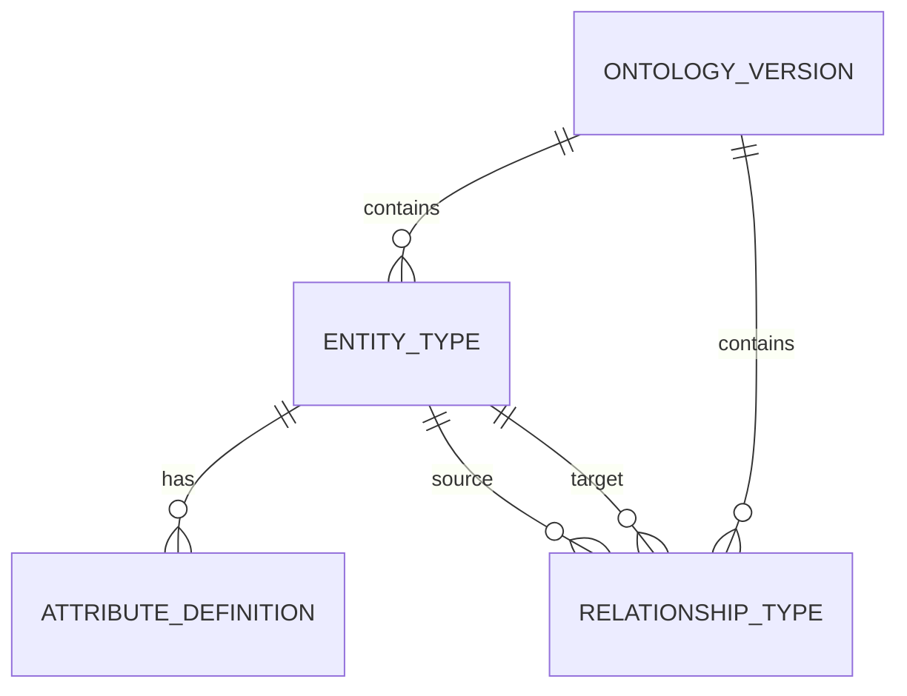

# Phase 1A — Ontology Structural Metadata

Design and implement the foundational metadata layer for a production-grade enterprise ontology runtime. This phase establishes the schema for defining **what types of entities exist**, **what attributes they have**, and **what relationships can exist between them** — all without hardcoding any domain-specific assumptions.

---

## Architectural Overview

### Core Design Principles

| Principle | Implementation |
|-----------|----------------|
| **Zero domain assumptions** | All business semantics stored as user-defined metadata, never in code |
| **Schema versioning** | `ontology_version` table with immutable snapshots; types reference versions |
| **Soft delete** | `deleted_at` timestamp on all entities; queries filter by default |
| **Future extension** | `metadata` JSONB column on all types for unforeseen attributes |
| **Strong typing** | Branded types in TypeScript; CHECK constraints in PostgreSQL |
| **Audit trail** | `created_at`, `updated_at`, `created_by` on all records |

---

## Schema Design

### 1. ontology_version
Schema versioning table:
- `id` (UUID, PK)
- `version` (SEMVER string, unique)
- `status` (enum: DRAFT, PUBLISHED, DEPRECATED)
- `created_at`, `updated_at`, `published_at`
- `created_by` (UUID, nullable)

### 2. entity_type
Defines what kinds of entities can exist:
- `id` (UUID, PK)
- `ontology_version_id` (FK → ontology_version)
- `name` (VARCHAR, unique per version)
- `display_name` (VARCHAR)
- `description` (TEXT)
- `metadata` (JSONB)
- `created_at`, `updated_at`, `deleted_at`

### 3. attribute_definition
Defines properties on entity types:
- `id` (UUID, PK)
- `entity_type_id` (FK → entity_type)
- `name` (VARCHAR, unique per entity type)
- `display_name` (VARCHAR)
- `data_type` (enum: STRING, INTEGER, FLOAT, BOOLEAN, DATE, DATETIME, JSON, ARRAY, REFERENCE)
- `is_required`, `is_unique`, `is_indexed` (BOOLEAN)
- `default_value`, `validation_rules` (JSONB)
- `ordinal` (INTEGER)
- `created_at`, `updated_at`, `deleted_at`

### 4. relationship_type
Defines relationships between entity types:
- `id` (UUID, PK)
- `ontology_version_id` (FK → ontology_version)
- `name` (VARCHAR, unique per version)
- `source_entity_type_id`, `target_entity_type_id` (FK → entity_type)
- `cardinality` (enum: ONE_TO_ONE, ONE_TO_MANY, MANY_TO_ONE, MANY_TO_MANY)
- `is_directional` (BOOLEAN)
- `inverse_name` (VARCHAR, nullable)
- `created_at`, `updated_at`, `deleted_at`

---

## Files Created

| File | Purpose |
|------|---------|
| `src/ontology/schema.sql` | PostgreSQL DDL |
| `src/ontology/types.ts` | TypeScript domain models |
| `src/ontology/invariants.md` | Invariant documentation |

---

## Status: ✅ COMPLETE
