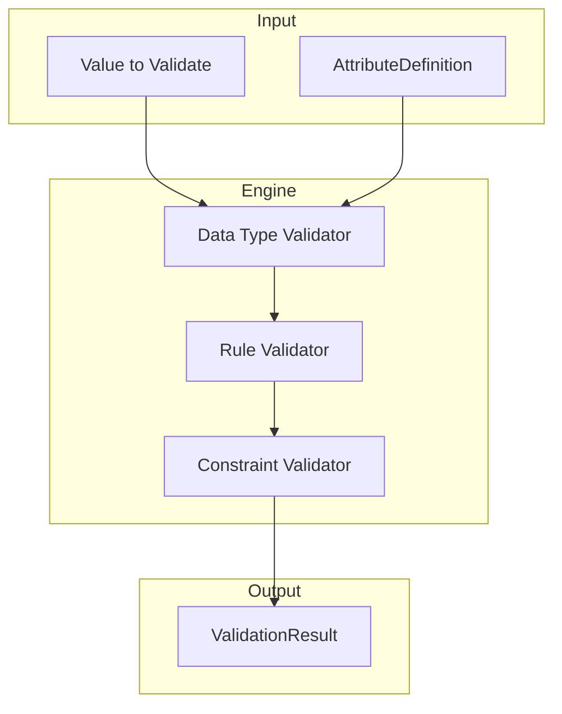
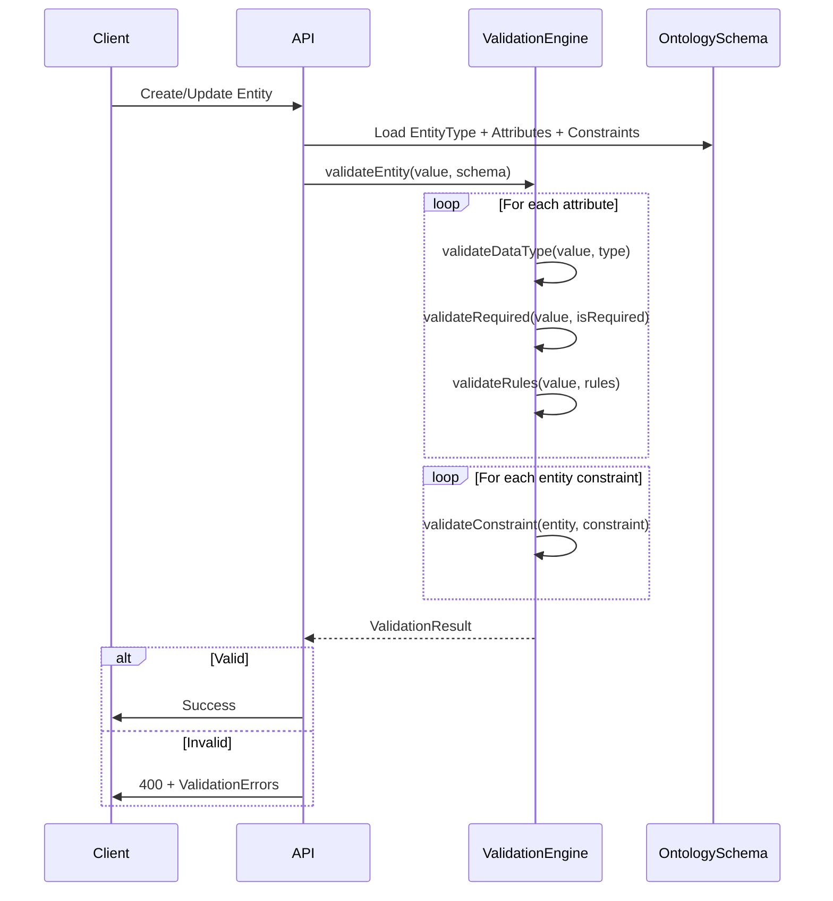

# Phase 1B — Ontology Structural Validation

Extend the ontology metadata layer with a comprehensive, metadata-driven validation system. All validation rules are declarative and stored as data — **no hard-coded logic**.

---

## Analysis of Phase 1A

Phase 1A already includes foundational validation support:

| Feature | Location | Status |
|---------|----------|--------|
| Required attributes | `attribute_definition.is_required` | ✅ Exists |
| Unique constraints | `attribute_definition.is_unique` | ✅ Exists |
| Data types | `attribute_definition.data_type` | ✅ Exists |
| Per-type validation rules | `attribute_definition.validation_rules` | ✅ Exists |
| Cardinality | `relationship_type.cardinality` | ✅ Exists |
| Allowed source/target | `relationship_type.source/target_entity_type_id` | ✅ Exists |

**What's missing:**
1. Entity-level constraints (cross-attribute validation)
2. Relationship instance constraints (min/max relationships per entity)
3. Validation engine (runtime execution of rules)
4. Complete validation rule type coverage

---

## Proposed Changes

### New: entity_constraint Table

```sql
CREATE TYPE constraint_type AS ENUM (
    'UNIQUE_TOGETHER',      -- Multiple attributes must be unique together
    'CONDITIONAL_REQUIRED', -- Attribute required if condition met
    'MUTUAL_EXCLUSION',     -- Only one of listed attributes can have value
    'CUSTOM_EXPRESSION'     -- User-defined expression (future)
);

CREATE TABLE entity_constraint (
    id UUID PRIMARY KEY,
    entity_type_id UUID NOT NULL REFERENCES entity_type(id),
    name VARCHAR(255) NOT NULL,
    constraint_type constraint_type NOT NULL,
    configuration JSONB NOT NULL,
    error_message VARCHAR(500),
    created_at TIMESTAMPTZ NOT NULL DEFAULT NOW(),
    updated_at TIMESTAMPTZ NOT NULL DEFAULT NOW(),
    deleted_at TIMESTAMPTZ
);
```

### Modified: relationship_type

Add relationship cardinality constraints:
```sql
ALTER TABLE relationship_type ADD COLUMN 
    source_min_count INTEGER DEFAULT 0,
    source_max_count INTEGER,
    target_min_count INTEGER DEFAULT 0,
    target_max_count INTEGER;
```

---

## Validation Engine Architecture



### Per-Type Validators

| File | Validates | Rules Supported |
|------|-----------|-----------------|
| `string-validator.ts` | STRING | min_length, max_length, pattern, enum_values |
| `numeric-validator.ts` | INTEGER, FLOAT | min, max, decimal_places |
| `boolean-validator.ts` | BOOLEAN | (type check only) |
| `date-validator.ts` | DATE, DATETIME | min_date, max_date |
| `array-validator.ts` | ARRAY | element_type, min_items, max_items, unique_items |
| `reference-validator.ts` | REFERENCE | target_entity_type_id |
| `json-validator.ts` | JSON | json_schema |

---

## Runtime Validation Flow



---

## File Structure After Phase 1B

```
src/ontology/
├── schema.sql              # Updated with entity_constraint table
├── types.ts                # Updated with constraint types
├── invariants.md           # Updated with validation invariants
└── validation/
    ├── validation-engine.ts
    ├── validation-types.ts
    └── validators/
        ├── index.ts
        ├── string-validator.ts
        ├── numeric-validator.ts
        ├── boolean-validator.ts
        ├── date-validator.ts
        ├── array-validator.ts
        ├── reference-validator.ts
        └── json-validator.ts
```

---

## Status: ✅ COMPLETE
